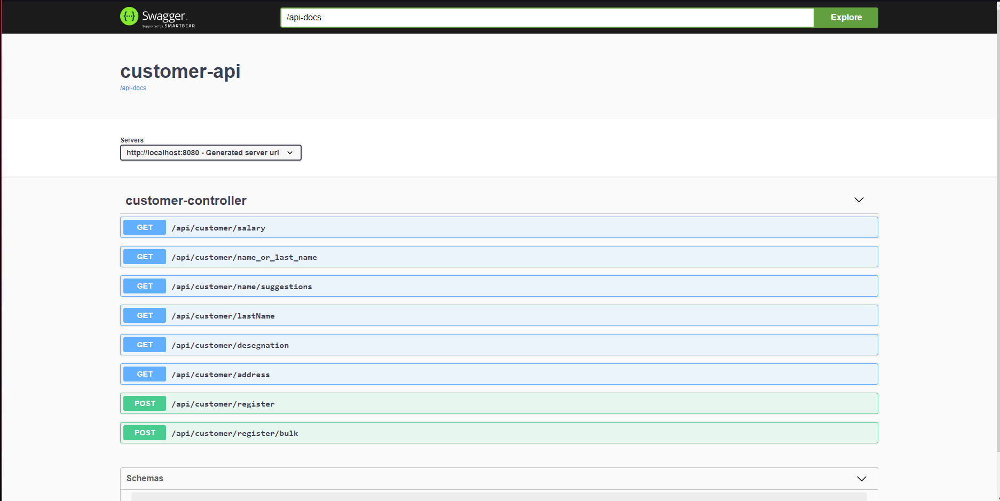
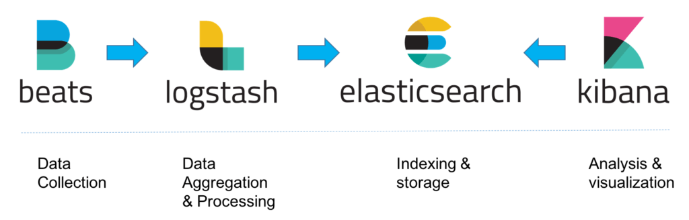
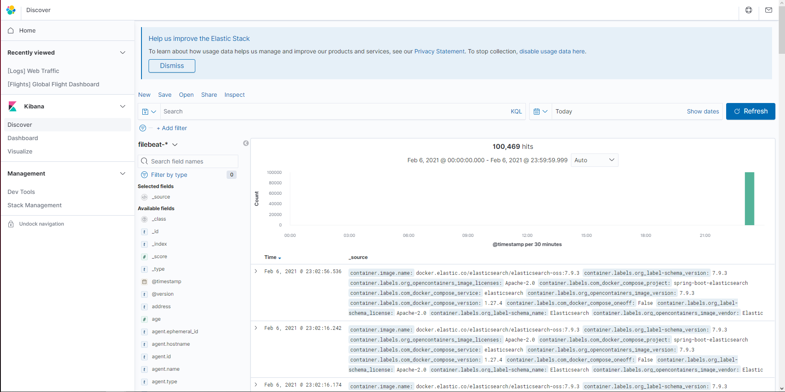
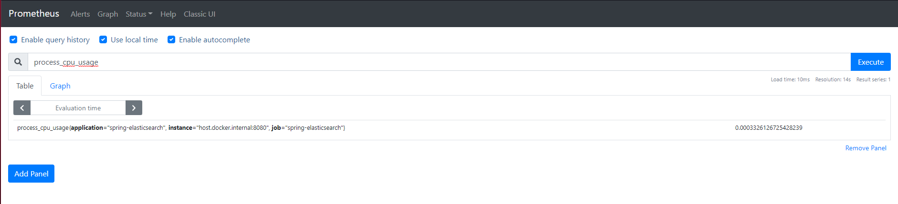
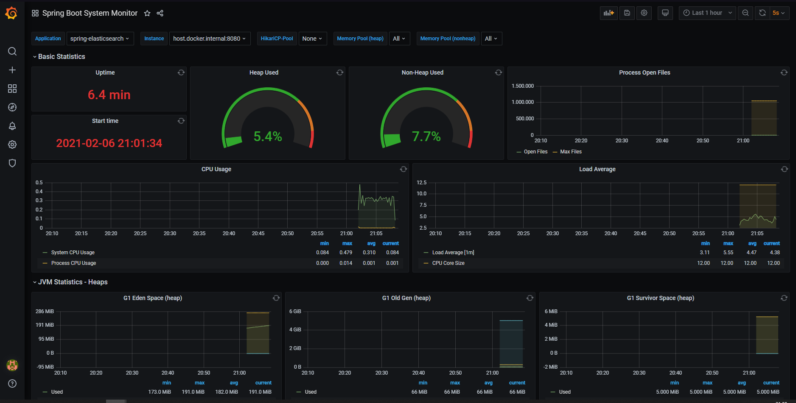
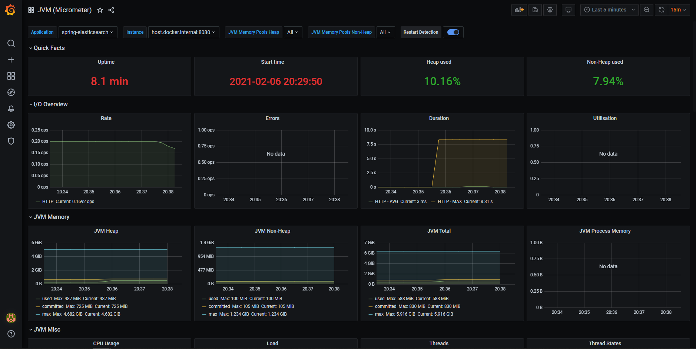
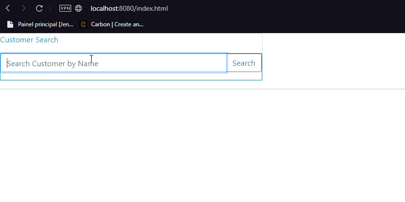

# Spring Data Elasticsearch e ELK Stack com Filebeat 


# Introdução
`Elasticsearch` é um mecanismo de pesquisa de texto completo projetado especialmente para trabalhar com grandes conjuntos de dados. Seguindo essa descrição, é uma escolha natural usá-lo para armazenar e pesquisar logs de aplicativos e conjunto com `Logstash` e `Kibana`, é parte de uma solução poderosa chamada `Elastic Stack`, ou para os mais proximos `ELK STACK`. Porém manter logs de aplicativos não é o único caso de uso do Elasticsearch. Nesse projeto iremos desenvolver um exemplo da utilização do Elasticsearch como banco dados `NoSQL` através do `Spring Data Elasticsearch` e a utilização do `RestHighLevelClient` para inserção de alto volume de dados e buscas personalizadas em index especificos. Utilizamos nesse projeto um payload no qual contém 50k de dados para ser inseridos no Elasticsearch no start-up da aplicação. Por fim para complementar o ecossistema foi implementado o Micrometer(Prometheus) mecanismo para exportação de métricas, em conjunto com o `Spring Boot Actuator`,  e o `Grafana` que é uma plataforma para visualizar e analisar métricas por meio de dashboard.

# Pré-requisitos
- [`Java 11+`](https://www.oracle.com/java/technologies/javase-jdk11-downloads.html)
- [`Docker`](https://www.docker.com/)
- [`Docker-Compose`](https://docs.docker.com/compose/install/)
- [`Maven`](https://maven.apache.org/download.cgi)

# Como usar
- Primeiramente faça o clone do projeto do github:
```sh
$ git clone https://github.com/thukabjj/spring-boot-elasticsearch.git
``` 

- Acesse a pasta do projeto customer-api e execute os seguintes comandos:
```sh
$ mvn package -DskipTests
``` 

Após a compilação do projeto, execute o comando:
```sh
$ cd target
``` 
```sh
$ java -Djarmode=layertools -jar target/customer-api-0.0.1-SNAPSHOT.jar extract
``` 
Após a execução do comando retorne para a pasta raiz do projeto.

- Após os preparativos, basta rodar comando a seguir na pasta raiz:
```sh
$ docker-compose up -d --build --remove-orphans
``` 
Para vizualizar todos os endpoints basta acessar a URL:
```
http://localhost:8080/swagger-ui.html
```

### Monitoramento (Observability)
Quando trabalhamos microserviços é recomendado ter um ecossitema de facil acesso para que monitore os log distribuidos de sua aplicação, no nosso cenario utilizamos um conjunto de soluções na qual compunham o famoso ELK STACK (Elasticsearch, Logstash e Kibana) com o adicional do Filebeat que é responsável por ler os arquivos de log e enviar para o logstash. Para complementar o nosso monitoramento além dos logs da aplicação, precisamos monitorar as metricas de nossa aplicação para nós ajudar com isso foi utilizado o Spring Boot Actuator, Micrometer e o Grafana para vizualização dessas metricas em forma de dashboard interativo. Segue as informações a seguir:

 - Elasticsearch: É o servidor de busca distribuído que irá armazenar os logs. 
 - Logstash: É o responsável por parsear os logs e enviar para o elasticsearch.
 - Filebeat: É responsável por remove a necessidade do logstash de ler arquivos diretamente do disco.
 - Kibana: É o que permite a criação de visualizações e dashboards baseadas em buscas realizadas no elasticsearch. 

#### Kibana
Para acessar o Kibana basta acessar: 
```
http://localhost:5601
```

Para vizualizar os logs faça os passos a seguir:
*  Acesse o `Kibana`
*  Clique na opção a esqueda `Discover`
*  No campo `index pattern name` coloque o nome do index que é gerado pelo filebeat `filebeat-*`
*  Na opção `Time field` selecione a opção `@timestamp` e clique no botão `Create index pattern`
*  Após essa configuração basta clicar novamente na opção `Discover` que irá vizualizar as informações do container e da aplicação


#### Prometheus
Para acessar o prometheus basta acessar:
```
http://localhost:9090
```


#### Grafana
Para acessar o grafana basta acessar a url abaixo e por `dafault` o usuario e senha é `admin`:
```
http://localhost:3000
```
Foi adicionado dois dashboards feitos pela comunidade para monitoramento da aplicação para acessa-los basta ir na opção `Dashboards>home`
e irá aparecer o `Spring Boot System Monitor` e o `JVM (Micrometer)` basta clicar em um dos dois para vizualiza-los/altera-los.



# Bonus
Para exemplifcar uma utilização do Elasticsearch foi desenvolvido um endpoint no qual tem como responsabilidae devolver os nomes e sobrenomes apartir do input do usuario, nesse endpoint foi utilizado `RestHighLevelClient` com a estrategia de `Fuzzy Query` no qual tem como objetivos nos retornar os dadosque contêm termos semelhantes ao termo de pesquisa, conforme medido por uma distância de edição de [`Levenshtein`](https://www.elastic.co/guide/en/elasticsearch/reference/current/query-dsl-fuzzy-query.html). 
Para acessa-la bastar acessar:

```
localhost:8080/index.html
```

Uma distância de edição é o número de alterações de um caractere necessárias para transformar um termo em outro. Essas mudanças podem incluir: 
* Mudando um personagem (caixa → raposa).
* Removendo um caractere (preto → falta)
* Inserindo um personagem (sic → doente)
* Transpondo dois caracteres adjacentes (agir → gato)
Para encontrar termos semelhantes, a `fuzzy` query cria um conjunto de todas as variações ou expansões possíveis do termo de pesquisa dentro de uma distância de edição especificada. E retorna a correspondências exatas para cada variação.

# Referências
* https://imasters.com.br/devsecops/configurando-elk-com-docker-e-filebeat
* https://piotrminkowski.com/2019/03/29/elasticsearch-with-spring-boot/
* https://github.com/ivangfr/springboot-elk-prometheus-grafana
* https://www.baeldung.com/spring-data-elasticsearch-tutorial
* https://medium.com/groww-engineering/simple-search-service-using-springboot-and-elasticsearch-1-aa09e2c98359
